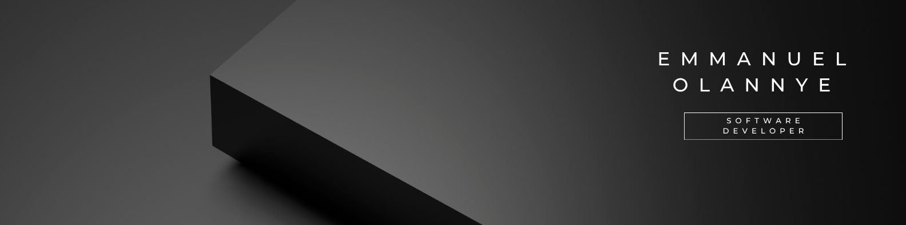

Hello, my name is Emmanuel.

I’m a recent high school graduate currently exploring the world of coding, storytelling, and creative problem-solving. While I’m still early in my programming journey, I’m always excited to learn, build, and improve my skills one project at a time.

I believe coding is one of the most valuable skills to have in the 21st century. It combines creativity, logic, and innovation, allowing people to bring ideas to life and solve real-world problems in unique ways.

To me, coding is like writing a story for a computer — every line of code shapes how the story unfolds and what results it produces. My journey is still just beginning, and I’m looking forward to seeing how far it can take me.

<ins>My Programming Skills (so far)</ins>
* HTML (Hyper Text Markup Language)
* JavaScript
* Java
* CSS
* Markdown
* C#
* SQL

<ins>Frameworks and Technologies that I have worked with</ins>
* Node.js
* ASP.NET
* SMSS

<ins>Current Skill Confidence</ins>
* HTML: 50% 
* JavaScript: 30% 
* Java: 25% 
* Markdown: 60%
* SQL: 50%
* C#: 60% 

## 🐍 Contribution Snake

<ins>Goals</ins>

I want to become the kind of developer who can both think creatively and solve technical problems effectively. 
My goal is not just to learn programming languages, but to understand how technology can be used to build meaningful experiences, tell stories, and help people.
